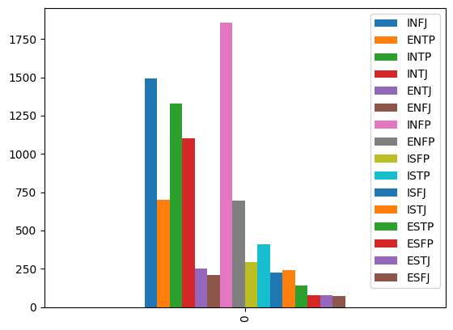

#  Psychotypes analysis by Myers–Briggs Type Indicator
HSE ML course project (2nd year)

### Team:
- Kuznetsov Nikita
- Levin Mark

### Installing dependencies
```console
foo@bar:~$ pip3 install -r requirements.txt
```

##  Source data description
There are two datasets:
- [dataset](https://www.kaggle.com/datasets/datasnaek/mbti-type) from kaggle.com, csv file containing two columns -- type (psychotype class, 16 in total) and posts (a person’s post on a social network in text format).
- For additional data, we manually parsed articles from the [forum](https://www.personalitycafe.com) written by people with psychotypes designated mbti.

## Our purposes
Write a model that determines 1 of 16 MBTI psychotypes of a person based on the written text.
A telegram bot was also written to interact with users.
Improve metric results by adding additional data from the forum mentioned above.

## Used algorithms

- For preprocessing, we've removed punctuation and unnecessary information that didn't contain meangful text, conducted experiments with lemmatization and stemming, stemming turned out to be better.
- We have chosen TF-IDF to create embeddings.
- There was no explicit choice regarding the models; experiments were carried out with logistic regression, catboost, xgboost, and random forest.

## Metrics

There is a classification problem with highly unbalanced classes (confirmation of this is below, a graph correlating the number of posts of people with psychotype classes), so we decided to take F1 score.




## Results
The results from stemming were slightly better than those from lemmatization. Also, after adding an additional dataset, the results increased by 0.02 on average. (more details - in jupyter notebooks)

There are some of them (with supplemented dataset):
- Catboost (stemming): 0.676
- Xgboost (stemming): 0.671
- LogisticRegression (stemming): 0.645
- Catboost (lemmatization): 0.671
- Xgboost (lemmatization): 0.664
- LogisticRegression (lemmatization): 0.621
- RandomForestClassifier (stemming): 0.432
